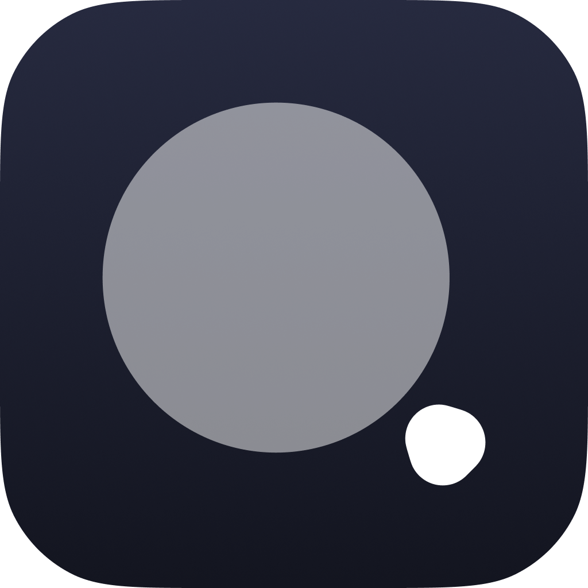

# GlanceGo | Desktop

Find everything you're looking for | An open-source file finder and application
launcher designed to streamline your workflow.

## 📦 Tech Stack

* [Dart](hhttps://dart.dev/)
* [Flutter](https://flutter.dev/)
* [SQLite3](https://www.sqlite.org/)

## 🖥️ Platforms

* Linux(snap) 🟡
* macOS(>=11.5) ✅
* Windows(>=10.0) 🟡

## 🧑‍💻 Contributing

🚫 This project is not accepting external contributions at the moment while
core development is still in progress. Stay tuned for updates!

## 📜 Credits

* SoftYes TI [\<softyes.com.br\>](https://softyes.com.br)
* João Sereia [\<joao.sereia@softyes.com.br\>](mailto:joao.sereia@softyes.com.br)
